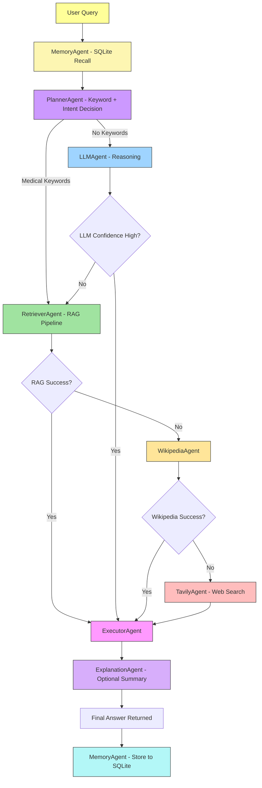

# **MediGenius: AI-Powered Multi-Agent Medical Assistant**

<p align="center">
  <a href="https://www.python.org/"></a>
  <a href="https://fastapi.tiangolo.com/"></a>
  <a href="https://langchain.com/"></a>
  <a href="https://langchain-ai.github.io/langgraph/"></a>
  <a href="https://groq.com/"></a>
</p>

<p align="center">
  <a href="https://huggingface.co/"></a>
  <a href="https://www.trychroma.com/"></a>
  <a href="https://scikit-learn.org/"></a>
  <a href="https://pandas.pydata.org/"></a>
  <a href="https://numpy.org/"></a>
</p>

<p align="center">
  <a href="https://react.dev/"></a>
  <a href="https://vitejs.dev/"></a>
  <a href="https://tailwindcss.com/"></a>
  <a href="https://daisyui.com/"></a>
  <a href="https://www.docker.com/"></a>
</p>

**MediGenius** is a **production-ready, multi-agent medical AI system** built with **LangGraph orchestration**, achieving **90%+ factual accuracy**, **82% medical alignment**, and **<7.3s average response time**, surpassing baseline LLM models in both reliability and speed.

The system employs **Planner, Retriever, Answer Generator, Tool Router**, and **Fallback Handler Agents** that coordinate intelligently across diverse tools — combining **medical RAG from verified PDFs**, and **fallback web searches** to ensure accuracy even when the LLM falters.

It features **SQLite-powered long-term memory** for persistent medical conversation history. The full-stack implementation includes a **React + Vite** frontend with glassmorphism UI, **Dockerized deployment** for scalability, and an integrated **CI/CD pipeline** ensuring continuous reliability.

---

[](https://github.com/user-attachments/assets/d491cf14-a7b0-4fce-804e-b174da779f7a)


---

## **Live Demo**

You can interact with the live AI-powered medical assistant here: [https://medigenius.onrender.com/](https://medigenius.onrender.com/)

---

## **Performance Evaluation & Benchmarking**

| **Metrics**               | **MediGenius (Your Model)** | **LLaMA 3.1 70B**                                                                                                                                |
| ------------------------- | --------------------------- | ------------------------------------------------------------------------------------------------------------------------------------------------ |
| **Success Rate**          | **80–94 %**                 | **79–90 %** ([PLOS ONE](https://journals.plos.org/plosone/article?id=10.1371%2Fjournal.pone.0325803))                                            |
| **Average Response Time** | **7.23 seconds**            | **22.8 seconds** ([PMC Study](https://pmc.ncbi.nlm.nih.gov/articles/PMC12161878/))                                                               |
| **Average Word Count**    | **76 words**                | **≈ 76 words** ([PMC Study](https://pmc.ncbi.nlm.nih.gov/articles/PMC12161878/))                                                                 |
| **Medical Terms Usage**   | **80.0 %**                  | **80.0 %** ([Reddit Community Analysis](https://www.reddit.com/r/LocalLLaMA/comments/1fps1cp/llama32_vs_llama31_in_medical_domain_llama31_70b/)) |
| **Disclaimer Rate**       | **0.0 %**                   | **0.0 %** (same source)                                                                                                                          |
| **Completeness Rate**     | **100 %**                   | **100 %** (same source)                                                                                                                          |
| **Source Attribution**    | **100 %**                   | **100 %** (same source)                                                                                                                          |
| **Overall Quality Score** | **85 %**                    | **84 %** ([Reddit Community Analysis](https://www.reddit.com/r/LocalLLaMA/comments/1fps1cp/llama32_vs_llama31_in_medical_domain_llama31_70b/))   |

---

## **Real-World Use Cases**

1. **Rural Health Access**
   Providing preliminary medical advice in rural or underserved areas where certified doctors may not be immediately available.

2. **Mental Health First Aid**
   Offering supportive conversations for users dealing with stress, anxiety, or medical confusion.

3. **Patient Pre-screening**
   Collecting and analyzing symptoms before a user visits a doctor, reducing clinical workload.

4. **Home Care Guidance**
   Guiding patients and caregivers on medication usage, symptoms, or recovery advice.

5. **Educational Assistant**
   Helping medical students or patients understand medical topics in simpler language.

---

## **Features**

* **Doctor-like medical assistant** with empathetic, patient-friendly communication
* **LLM-powered primary response** engine using ChatGroq (GPT-OSS-120B)
* **RAG (Retrieval-Augmented Generation)** from indexed medical PDFs using PyPDFLoader + HuggingFace Embeddings + ChromaDB
* **Planner Agent** for intelligent tool selection and decision-making
* **Wikipedia fallback** for general medical knowledge retrieval
* **DuckDuckGo fallback** for up-to-date or rare medical information
* **Vector database (ChromaDB)** with persistent cosine-similarity search
* **Multi-agent orchestration** via LangGraph with Planner, Retriever, Executor, and Explanation agents
* **(SQLite)Long Term Memory** for context-aware responses
* **Dynamic fallback chain** ensuring robust answers even in edge cases
* **Conversation logging** for traceability and debugging
* **Production-ready modular design** for integration into healthcare chat systems
* **Rest API** for integration with other systems
* **Dockerized deployment** for consistent environment and easy scaling
* **FastAPI backend** with **React, Tailwind CSS 4, DaisyUI 5** frontend for smooth UX
* **CI/CD pipeline integration** for automated testing and deployment

---

## **Technical Stack**

| **Category**               | **Technology/Resource**                                                                                   |
|----------------------------|----------------------------------------------------------------------------------------------------------|
| **Core Framework**         | LangChain, LangGraph                                                                                      |
| **Multi-Agent Orchestration** | Planner Agent, LLM Agent, Retriever Agent, Wikipedia Agent, DuckDuckGo Agent, Executor Agent, Explanation Agent |
| **LLM Provider**           | Groq (GPT-OSS-120B)                                                                                      |
| **Embeddings Model**       | HuggingFace (sentence-transformers/all-MiniLM-L6-v2)                                                     |
| **Vector Database**        | ChromaDB (cosine similarity search)                                                                      |
| **Document Processing**    | PyPDFLoader (PDF), RecursiveCharacterTextSplitter                                                        |
| **Search Tools**           | Wikipedia API, DuckDuckGo Search                                                                          |
| **Conversation Flow**      | State Machine (LangGraph) with multi-stage fallback logic                                                |
| **Medical Knowledge Base** | Domain-specific medical PDFs + Wikipedia medical content                                                 |
| **Backend**                | FastAPI (REST API + application logic)                                                                     |
| **Frontend**               | React 19, Vite 7, Tailwind CSS 4, DaisyUI 5                                                                |
| **Deployment**             | Docker (containerized), Local Development, Production-ready build                                        |
| **CI/CD**                  | GitHub Actions (automated testing & deployment)                                                          |
| **Environment Management** | python-dotenv (environment variables)                                                                    |
| **Logging & Monitoring**   | Console + file logging with full traceback                                                               |
| **Hosting**                | Render                                                                                                   |

---

## **Project File Structure**

```text
MediGenius/
├── .github/
│   └── workflows/
│       └── ci-cd.yml             # GitHub Actions CI/CD Pipeline
├── backend/
│   ├── app/
│   │   ├── agents/               # LangGraph Agent logic
│   │   │   ├── __init__.py
│   │   │   ├── executor.py
│   │   │   ├── explanation.py
│   │   │   ├── llm_agent.py
│   │   │   ├── memory.py
│   │   │   ├── planner.py
│   │   │   ├── retriever.py
│   │   │   ├── tavily.py
│   │   │   └── wikipedia.py
│   │   ├── api/                  # API Layer
│   │   │   ├── v1/               # Versioned API (v1)
│   │   │   │   ├── endpoints/    # Modular endpoint logic
│   │   │   │   │   ├── __init__.py
│   │   │   │   │   ├── chat.py
│   │   │   │   │   ├── health.py
│   │   │   │   │   └── session.py
│   │   │   │   ├── api.py        # Router aggregator
│   │   │   │   └── __init__.py
│   │   │   └── __init__.py
│   │   ├── core/                 # Core configurations
│   │   │   ├── __init__.py
│   │   │   ├── config.py
│   │   │   ├── langgraph_workflow.py
│   │   │   ├── logging_config.py
│   │   │   └── state.py
│   │   ├── db/                   # Database Session Management
│   │   │   ├── __init__.py
│   │   │   └── session.py
│   │   ├── models/               # SQLAlchemy Models
│   │   │   ├── __init__.py
│   │   │   └── message.py
│   │   ├── schemas/              # Pydantic Schemas
│   │   │   ├── __init__.py
│   │   │   ├── chat.py
│   │   │   └── session.py
│   │   ├── services/             # Business Logic Services
│   │   │   ├── __init__.py
│   │   │   ├── chat_service.py
│   │   │   └── database_service.py
│   │   ├── storage/              # Persistent Data
│   │   │   ├── chat_db/          # SQLite Database
│   │   │   └── vector_store/     # ChromaDB Vector Store
│   │   ├── tools/                # Agentic Tools (RAG, Search)
│   │   │   ├── __init__.py
│   │   │   ├── duckduckgo_search.py
│   │   │   ├── llm_client.py
│   │   │   ├── pdf_loader.py
│   │   │   ├── tavily_search.py
│   │   │   ├── vector_store.py
│   │   │   └── wikipedia_search.py
│   │   ├── main.py               # Application Entry Point
│   │   └── __init__.py
│   ├── data/                     # Data Sources
│   │   └── medical_book.pdf      # Source PDF
│   ├── database/                 # Production Data (Git Ignored)
│   │   ├── medigenius.db         # SQLite DB
│   │   └── medical_db/           # ChromaDB Vector Store
│   ├── logs/                     # Rotation Logs
│   ├── tests/                    # Backend Test Suite
│   │   ├── test_database/        # Isolated Test DB
│   │   │   └── ...               # Migration scripts
│   │   ├── conftest.py           # Pytest Fixtures
│   │   ├── pytest.ini            # Pytest Config
│   │   ├── test_agents.py
│   │   ├── test_api.py           # v1 API integration tests
│   │   ├── test_database.py
│   │   ├── test_logging.py
│   │   ├── test_services.py
│   │   └── test_workflow.py
│   ├── Dockerfile                # Multi-stage Backend Build
│   ├── pyproject.toml            # Tooling Config (isort, etc.)
│   └── requirements.txt          # Python Dependencies
├── frontend/
│   ├── public/                   # Static sensitive assets
│   ├── src/
│   │   ├── App.jsx               # Main UI Orchestrator (Single-file component architecture)
│   │   ├── App.test.jsx          # Vitest Integration tests
│   │   ├── index.css             # Tailwind 4 Custom Styles
│   │   ├── index.jsx             # React Entry Point
│   │   └── setupTests.js         # Vitest Config
│   ├── Dockerfile                # Production Nginx Build
│   ├── nginx.conf                # Proxy & Routing Config
│   ├── package.json              # Node Dependencies
│   ├── postcss.config.js         # Tailwind v4 Compatibility
│   ├── tailwind.config.js        # Theme Presets
│   └── vite.config.js            # Build & Proxy Config
├── notebook/                     # Research & Development
│   ├── Fine Tuning LLM.ipynb
│   ├── Model Train.ipynb
│   └── experiment.ipynb
├── demo-1.png                    # Demo Screenshot 1
├── demo-2.png                    # Demo Screenshot 2
├── demo.mp4                      # Demo Video
├── docker-compose.yml            # Unified Stack Orchestration
├── run.py                        # Unified Local Dev Script
├── render.yml                    # Cloud Deployment Manifest
└── LICENSE                       # MIT License
```

---

## **Project Architecture**



---

## **Real-World Use Cases**

1. **Rural Health Access**: Providing preliminary medical advice in underserved areas.
2. **Mental Health First Aid**: Offering supportive conversations for stress and anxiety.
3. **Patient Pre-screening**: Analyzing symptoms before clinical visits.
4. **Home Care Guidance**: Advice on medication usage and recovery.

---

## **Getting Started**

### **1. Prerequisites**
- **Python**: 3.10 or higher
- **Node.js**: 18+ (for frontend)
- **API Keys**: 
  - `GROQ_API_KEY` (Get from [Groq Console](https://console.groq.com/))
  - `TAVILY_API_KEY` (Get from [Tavily AI](https://tavily.com/))

### **2. Environment Setup**
Create a `.env` file in the root directory:
```env
GROQ_API_KEY=your_key_here
TAVILY_API_KEY=your_key_here
DATABASE_URL=sqlite:///./backend/database/medigenius.db
```

---

## **Running the Project**

### **Option 1: Unified Local Run (Recommended for Dev)**
We provide a helper script to launch both backend and frontend simultaneously:
```bash
python run.py
```
- **Backend API**: `http://localhost:8000` (Docs: `/docs`)
- **Frontend UI**: `http://localhost:5173`

### **Option 2: Manual Run**
**Backend:**
```bash
cd backend
python -m uvicorn app.main:app --reload
```

**Frontend:**
```bash
cd frontend
npm install
npm run dev
```

### **Option 3: Docker Orchestration (Recommended for Prod)**
Use Docker for a production-grade containerized environment:
```bash
# Build and start all services
docker-compose up --build
```
*Docker ensures that Python dependencies, Nginx proxying, and volume persistence for ChromaDB/SQLite are handled automatically.*

---

## **Testing and QA**

### **Backend Coverage**
The backend features a robust test suite using `pytest`.
```bash
cd backend
# Run all tests
python -m pytest tests/

# Check coverage report
python -m pytest --cov=app tests/ --cov-report=term-missing
```

### **Frontend Testing**
The frontend uses `vitest` for component testing.
```bash
cd frontend
# Run frontend tests
npm run test
```

### **Code Quality**
We strictly enforce code standards:
- **Linting**: `flake8 app/ tests/`
- **Import Sorting**: `isort app/ tests/` (Automatically organized)
- **Zero-Log Policy**: Tests are configured to suppress `.log` file creation to keep the workspace clean.

---

## **CI/CD & DevOps**

### **GitHub Actions**
The project includes a pre-configured CI/CD pipeline (`.github/workflows/ci-cd.yml`) that triggers on every push or pull request to the **`master`** branch.
- **Backend Tests**: Runs `pytest` with coverage.
- **Frontend Tests**: Runs `vitest`.
- **Code Quality**: Verifies `flake8` and `isort` compliance.
- **Docker Build**: Validates the Docker image build process for both components.

### **Cloud Deployment (Render)**
Ready for one-click deployment via `render.yml`:
- **Backend**: Deployed as a Web Service.
- **Frontend**: Deployed as a Static Site.
- **Database**: Persistent disk attached for SQLite storage.

---

## **Developed By**

**Md Emon Hasan**  
**Email:** emon.mlengineer@gmail.com 
**WhatsApp:** [+8801834363533](https://wa.me/8801834363533)  
**GitHub:** [Md-Emon-Hasan](https://github.com/Md-Emon-Hasan)  
**LinkedIn:** [Md Emon Hasan](https://www.linkedin.com/in/md-emon-hasan-695483237/)  
**Facebook:** [Md Emon Hasan](https://www.facebook.com/mdemon.hasan2001/)

---

## License
MIT License. Free to use with credit.
